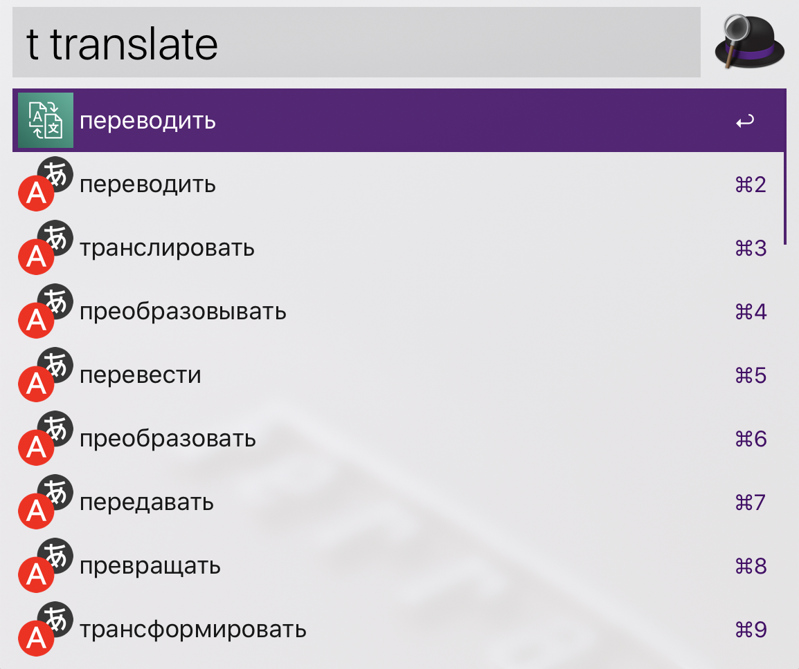

# Alfred translate workflow

RU <-> EN translation right in your Alfred window!
 - autodetect translate direction, no need to specify the source language
 - can translate both single words and whole sentences
 - show synonyms for the translated word
 - translate text selected in MacOs (with ^⌥⇧⌘ + T hotkey)
 - detect spelling errors and provide suggestions
 - copy translation results to the buffer

Translate using `t` keyword, hit `Enter` to copy translation result to the buffer

Hit `Enter` to autocomplete spelling suggestion

## Installation
Download latest Alfred workflow from [release page](https://github.com/toshyak/translate/releases). Set AWS credentials (AWS_ACCESS_KEY_ID and AWS_SECRET_ACCESS_KEY) for the IAM user with Translate service permissions, more information can be found [here](https://docs.aws.amazon.com/general/latest/gr/aws-sec-cred-types.html#access-keys-and-secret-access-keys).

---
This workflow was inspired by the https://github.com/podgorniy/alfred-translate , which has very similar set of feautures but uses Yandex.Translate service.